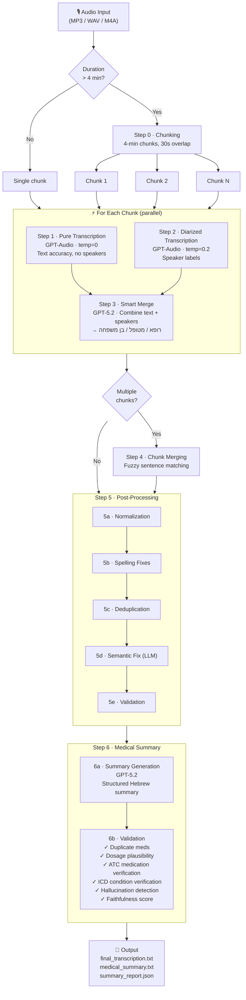

# Medical Diarization

Hebrew medical conversation transcription with speaker diarization, powered by Azure OpenAI — with a full-stack web UI for visualization, pipeline tracing, and audio playback.

## What This Project Does

This system takes an audio recording of a Hebrew medical conversation (doctor–patient dialogue) and produces a clean, structured transcription where every line is attributed to a speaker: **רופא** (doctor), **מטופל** (patient), or **בן משפחה** (family member).

Key capabilities:

- **Speaker diarization** — identifies who said what across multiple speakers
- **Medical term preservation** — keeps medical terminology in English (DVT, CT, PET-CT, MRI, Euthyrox, etc.)
- **Long audio support** — splits files >4 minutes into overlapping chunks processed in parallel
- **Hebrew spelling correction** — fixes common GPT transcription errors with a curated dictionary
- **Validation & audit trail** — every post-processing change is logged and numbers/terms are verified
- **Structured medical summary** — auto-generates a Hebrew clinical summary with built-in hallucination detection, medication duplicate detection, dosage plausibility checks, ATC medication verification, and ICD condition verification
- **Pipeline tracing** — captures text state at every processing step for debugging and comparison
- **Web UI** — upload audio, watch pipeline progress live, browse step-by-step diffs with grouped sidebar and hunk-based change viewer, re-run pipelines

## Pipeline Overview



## Pipeline Steps in Detail

### Step 0 — Audio Chunking

| Setting | Value |
|---------|-------|
| Max chunk length | 4 minutes |
| Overlap between chunks | 30 seconds |
| Format | Exported as MP3 |

If the audio is ≤4 minutes it is processed as a single chunk. Otherwise it is split so that each pair of consecutive chunks shares 30 seconds of overlapping audio; this overlap is later used to stitch them back together without content loss.

**Example — 12-minute recording:**

```
  Chunk 1: 0:00 ──────────── 4:00
  Chunk 2:           3:30 ──────────── 7:30
  Chunk 3:                      7:00 ──────────── 11:00
  Chunk 4:                                10:30 ── 12:00
                     ↑                     ↑
               30s overlap           30s overlap
```

Each chunk is processed independently through Steps 1–3, then all chunks are stitched together in Step 4.

---

### Step 1 — Pure Transcription (GPT-Audio)

A call to the **GPT-Audio** model with `temperature=0` and a system prompt that says: *transcribe word-for-word, keep medical terms in English, do NOT add speaker labels*. The goal is maximum **text accuracy**.

**Example output (Step 1):**

<div dir="rtl">

```
אז בוא נראה את תוצאות הבדיקות שלך. ה-CT חזה יצא נקי, אין ממצאים
חדשים. רמות הסוכר, A1C 7.1 אחוז, עדיין קצת מעל היעד. הכלסטרול
LDL 95, צריך להוריד אותו מתחת ל-70. לחץ דם 135 על 85, לא רע
אבל אפשר להשתפר. אני חושב שנעלה את האמלודיפים מ-5 ל-10 מיליגרם.
ומה לגבי התרופות האחרות, אתה לוקח את הכל? כן, אני לוקח. יופי,
מטפורמן ואטורבסטטין, את שניהם? כן. מצוין, נתראה בעוד שלושה חודשים.
```

</div>

> **Notice**: The text is accurate but has **no speaker labels** — it reads as a continuous paragraph. Medical terms like `CT`, `LDL`, `A1C` are kept in English.

---

### Step 2 — Diarized Transcription (GPT-Audio)

In **parallel** with Step 1, the same audio is sent to GPT-Audio again, this time instructed to identify all speakers (`[דובר 1]`, `[דובר 2]`, …). Uses `temperature=0.2`. The goal is accurate **speaker attribution**.

**Example output (Step 2) — same audio:**

<div dir="rtl">

```
[דובר 1]: אז בוא נראה את תוצאות הבדיקות שלך. ה-CT חזה יצא נקי,
אין ממצאים חדשים. רמות הסוכר, A1C 7.1 אחוז, עדיין קצת מעל היעד.
הכולסטרול LDL 95, צריך להוריד אותו מתחת ל-70.

[דובר 2]: כן, אני יודע שצריך להוריד.

[דובר 1]: לחץ דם 135 על 85. אני חושב שנעלה את ה-Amlodipine
מ-5 ל-10 מיליגרם. ומה לגבי התרופות, אתה לוקח את הכל?

[דובר 2]: כן, את הכל.
```

</div>

> **Notice**: Speaker labels are present (`[דובר 1]`, `[דובר 2]`), but the text quality may differ from Step 1 — e.g. `"הכלסטרול"` (Step 1) vs `"הכולסטרול"` (Step 2), `"האמלודיפים"` vs `"ה-Amlodipine"`.

---

### Step 3 — Smart Merge (GPT-5.2)

GPT-5.2 receives both outputs and merges them:
- Takes the **speaker structure** from Step 2 (who said what)
- Takes the **accurate text** from Step 1 where they differ
- Maps generic speaker IDs to semantic roles: `[רופא]`, `[מטופל]`, `[בן משפחה]`
- Normalizes medical terms to English

**Example — after merge:**

<div dir="rtl">

```
[רופא]: אז בוא נראה את תוצאות הבדיקות שלך. ה-CT חזה יצא נקי,
אין ממצאים חדשים. רמות הסוכר, A1C 7.1 אחוז, עדיין קצת מעל היעד.
הכלסטרול LDL 95, צריך להוריד אותו מתחת ל-70.
[מטופל]: כן, אני יודע שצריך להוריד.
[רופא]: לחץ דם 135 על 85. אני חושב שנעלה את האמלודיפים מ-5
ל-10 מיליגרם. ומה לגבי התרופות, מטפורמן ואטורבסטטין, לוקח הכל?
[מטופל]: כן, את הכל.
[רופא]: מצוין, נתראה בעוד שלושה חודשים.
```

</div>

> **What happened**:
> - `[דובר 1]` → `[רופא]`, `[דובר 2]` → `[מטופל]`, `[דובר 3]` → `[בן משפחה]`
> - Text accuracy taken from Step 1 where it differs
> - Speaker boundaries taken from Step 2

---

### Step 4 — Chunk Merging (Algorithmic)

For multi-chunk audio, an algorithmic (no-LLM) step merges consecutive chunk results:
1. Attempts exact substring matching at chunk boundaries
2. Falls back to sentence-level fuzzy matching (>70% character similarity)
3. Removes the overlapping section from the second chunk and concatenates

**Example — overlap detection between two chunks:**

```
── End of Chunk 1: ──
[רופא]: אז לגבי הבדיקות, אני רוצה שתעשה גם ECG ובדיקת מאמץ.
ה-LDL צריך לרדת מתחת ל-70, אז נעלה את ה-Atorvastatin
מ-20 ל-40 מיליגרם.
[רופא]: לגבי לחץ הדם, 135 על 85, נעלה את ה-Amlodipine ל-10.
בוא נבדוק שוב בעוד חודש.

── Start of Chunk 2: ──
[רופא]: לגבי לחץ הדם, 135 על 85, נעלה את ה-Amlodipine ל-10.        ← overlap detected
בוא נבדוק שוב בעוד חודש.                                             ← overlap detected
[מטופל]: בסדר, ואיך לגבי ה-Metformin?
[רופא]: Metformin אתה ממשיך עם 850 פעמיים ביום.

── After merge: ──
[רופא]: אז לגבי הבדיקות, אני רוצה שתעשה גם ECG ובדיקת מאמץ.     ← kept from Chunk 1
ה-LDL צריך לרדת מתחת ל-70, אז נעלה את ה-Atorvastatin
מ-20 ל-40 מיליגרם.
[רופא]: לגבי לחץ הדם, 135 על 85, נעלה את ה-Amlodipine ל-10.        ← kept from Chunk 1
בוא נבדוק שוב בעוד חודש.
[מטופל]: בסדר, ואיך לגבי ה-Metformin?                                ← new content from Chunk 2
[רופא]: Metformin אתה ממשיך עם 850 פעמיים ביום.
```

---

## Step 5 — Post-Processing Pipeline (Detailed)

The post-processing pipeline runs **five sequential stages** over the merged transcription. Three are fully deterministic, one uses a constrained LLM, and the final stage is a deterministic validator. Every change is recorded in a `PostProcessReport` audit trail.

### Stage A — Deterministic Normalization

**No LLM.** Cleans up formatting inconsistencies produced by the merge step.

| Rule | Example |
|------|---------|
| Collapse whitespace | Multiple spaces → single space |
| Fix speaker tag format | `[קופא]` → `[רופא]`, `[חולה]` → `[מטופל]`, `[רופאה]` → `[רופא]` |
| Ensure colon after tag | `[רופא] text` → `[רופא]: text` |
| Normalize punctuation | `??` → `?`, extra spaces after `:` removed |
| Standardize medical terms | `PET CT` → `PET-CT`, case-fix `tee` → `TEE`, `dvt` → `DVT`, `igg4` → `IgG4` |
| Remove blank lines | Empty lines are stripped |

**Example — before and after Stage A:**
```diff
  BEFORE:
- [רופאה] text about patient        ← wrong speaker tag
- [רופא]  extra  spaces  here       ← double spaces
- [מטופל] answer                     ← missing colon after tag
-                                    ← blank line
- [רופא]: we did a PET CT           ← should be PET-CT
- [רופא]: the dvt was confirmed     ← should be uppercase DVT

  AFTER:
+ [רופא]: text about patient        ✓ fixed tag
+ [רופא]: extra spaces here         ✓ collapsed whitespace
+ [מטופל]: answer                   ✓ added colon
+                                    ✓ blank line removed
+ [רופא]: we did a PET-CT           ✓ standardized
+ [רופא]: the DVT was confirmed     ✓ uppercased
```

### Stage B — Dictionary Spelling Fixes

**No LLM.** Applies a curated dictionary of ~30 known Hebrew transcription errors. Only **exact string matches** are replaced — no fuzzy logic. Examples:

| Error (Hebrew) | Correction | Meaning |
|----------------|------------|---------|
| עזות | הזעות | "sweating" |
| עקומול | אקמול | "Acamol" (paracetamol) |
| תחילות | בחילות | "nausea" |
| הרמונית | ערמונית | "prostate" |
| מייחה | ליחה | "phlegm" |
| מערך העצם | מח העצם | "bone marrow" |
| בכום הלב | בקרום הלב | "pericardium" |
| קרדיולוק | קרדילול | "Carvedilol" |
| מולטאק | Multaq | drug name → English |
| אולטרסאונד | Ultrasound | medical term → English |

A set of **protected medical terms** (DVT, CT, PET-CT, TEE, MRI, ECG, IgG4, etc.) is never modified, even if a dictionary key appears as a substring inside them.

**Example — before and after Stage B:**
```diff
  BEFORE:
- [מטופל]: יש לי עזות בלילה ותחילות בבוקר
- [רופא]: בואי נבדוק את בכום הלב
- [מטופל]: הרופא רשם לי קרדיולוק ומולטאק

  AFTER:
+ [מטופל]: יש לי הזעות בלילה ובחילות בבוקר    ← עזות→הזעות, תחילות→בחילות
+ [רופא]: בואי נבדוק את בקרום הלב               ← בכום הלב→בקרום הלב
+ [מטופל]: הרופא רשם לי קרדילול ו-Multaq        ← קרדיולוק→קרדילול, מולטאק→Multaq
```

### Stage C — Deduplication

**No LLM.** Removes content that was duplicated during chunk merging or transcription. Two passes:

1. **Exact duplicate removal** — consecutive lines with identical fingerprints (after removing speaker tags, punctuation, normalizing Hebrew final letters ך→כ, ם→מ, etc.) are collapsed into one.
2. **Near-duplicate block removal** — a sliding window of 1–4 lines is compared against the previous 20 lines using `SequenceMatcher`. Blocks with **>85% similarity** are removed.

**Example — before and after Stage C:**
```diff
  BEFORE (duplicate block from chunk overlap):
  [רופא]: לגבי לחץ הדם, 135 על 85, נעלה את ה-Amlodipine ל-10
  מיליגרם. בוא נבדוק שוב בעוד חודש.
  [מטופל]: בסדר.
  [רופא]: Metformin אתה ממשיך עם 850 פעמיים ביום.
  [מטופל]: כן, את הכל.
  [רופא]: ויש לנו גם Atorvastatin 40 מיליגרם.
  [מטופל]: בסדר.
  [רופא]: אז ECG ומבחן מאמץ.

- [רופא]: לגבי לחץ הדם, 135 על 85, נעלה את ה-Amlodipine ל-10     ← 89% similar to block above
- מיליגרם. בוא נבדוק שוב בעוד חודש.                                ← REMOVED
- [מטופל]: בסדר.                                                    ← REMOVED
- [רופא]: Metformin אתה ממשיך עם 850 פעמיים ביום.                  ← REMOVED
- [מטופל]: כן, את הכל.                                              ← REMOVED

  AFTER:
  [רופא]: לגבי לחץ הדם, 135 על 85, נעלה את ה-Amlodipine ל-10
  מיליגרם. בוא נבדוק שוב בעוד חודש.
  [מטופל]: בסדר.                                            ✓ kept only one copy
  [רופא]: Metformin אתה ממשיך עם 850 פעמיים ביום.
  [מטופל]: כן, את הכל.
  [רופא]: ויש לנו גם Atorvastatin 40 מיליגרם.
  [מטופל]: בסדר.
  [רופא]: אז ECG ומבחן מאמץ.
```

### Stage D — Semantic Fix (Constrained LLM)

**Uses GPT-5.2**, but with strict constraints. The prompt explicitly lists:

- **All numbers** extracted from the text (must be preserved exactly)
- **All medical terms** extracted from the text (must not be changed)
- **Forbidden actions**: cannot invent diagnoses, tests, or medications; cannot shorten the text; cannot change speaker tags

**Allowed corrections**:
- Hebrew grammar (gender agreement, singular/plural)
- Broken or cut-off words
- Incorrect word order

A **safety check** rejects the LLM output if it is <90% of the original length — the original text is kept instead.

**Example — before and after Stage D:**
```diff
  BEFORE:
- [רופא]: שתי בדיקות שצריך לעשות                 ← gender error (שתי→שני)
- [מטופל]: הכל במגמת שיפור, יותר איתי             ← broken word (איתי→איטי)
- [רופא]: עכשיו אתה כבר עשו בדיקת מאמץ           ← broken verb (עשו→עשית)
- [רופא]: התוצאות כמו שספיתי שהן יהיו             ← broken word (ספיתי→ציפיתי)

  AFTER:
+ [רופא]: שני בדיקות שצריך לעשות                  ✓ gender agreement fixed
+ [מטופל]: הכל במגמת שיפור, יותר איטי              ✓ broken word fixed
+ [רופא]: עכשיו אתה כבר עשית בדיקת מאמץ           ✓ verb conjugation fixed
+ [רופא]: התוצאות כמו שציפיתי שהן יהיו             ✓ broken word reconstructed

  NOT changed (preserved by constraint):
  [רופא]: A1C של 7.1 אחוז                          ✓ number 7.1 preserved
  [רופא]: LDL הוא 95                                 ✓ number 95 and term LDL preserved
  [רופא]: Amlodipine 10 מיליגרם                      ✓ dosage 10 preserved
```

### Stage E — Validation

**No LLM.** A final audit that compares the text before and after processing:

| Check | Action on failure |
|-------|-------------------|
| **Numbers preserved** | Compares all numbers (integers, decimals, percentages) before vs. after. Missing numbers → warning + validation fails |
| **Medical terms preserved** | Compares English medical terms and known Hebrew medical terms before vs. after. Missing terms → warning + validation fails |
| **No hallucinated terms** | New medical terms that weren't in the original (and didn't come from the spelling dictionary) are flagged as possible hallucinations |
| **Speaker tag sanity** | Counts `[רופא]`, `[מטופל]`, `[בן משפחה]` lines. Flags if >5 lines have no speaker tag, or if one speaker has >90% of all lines |

**Example — validation output (`postprocess_report.json`):**
```json
{
  "stage_a_changes": 54,
  "stage_b_replacements": [],
  "stage_c_duplicates_removed": 1,
  "stage_c_duplicate_lines": [86],
  "stage_d_corrections": [],
  "stage_e_warnings": [],
  "validation_passed": true,
  "numbers_before_count": 18,
  "numbers_after_count": 18,
  "medical_terms_before": ["A1C", "Amlodipine", "Atorvastatin", "CT", "ECG", "LDL", "Metformin"],
  "medical_terms_after":  ["A1C", "Amlodipine", "Atorvastatin", "CT", "ECG", "LDL", "Metformin"]
}
```

> All 18 numbers preserved ✓ · All 7 medical terms preserved ✓ · 1 duplicate block removed · Validation passed ✓

The result is a `PostProcessReport` containing every change, replacement, duplicate removed, and warning — saved as `postprocess_report.json`.

---

## Complete Pipeline Example — End to End

Below is a condensed view of how a single sentence transforms through the entire pipeline:

```
🎙️ Audio: Doctor says "יש לו הזעות בלילה ובחילות, עשינו PET CT"

Step 1 (Pure):       יש לו עזות בלילה ותחילות, עשינו PET CT
                     ↑ phonetic error   ↑ phonetic error

Step 2 (Diarized):   [דובר 1] יש לו עזות בלילה ותחילות, עשינו PET CT
                     ↑ has speaker ID but same text errors

Step 3 (Merge):      [רופא]: יש לו עזות בלילה ותחילות, עשינו PET CT
                     ↑ speaker mapped to role

Step 5a (Normalize): [רופא]: יש לו עזות בלילה ותחילות, עשינו PET-CT
                                                              ↑ PET CT → PET-CT

Step 5b (Spelling):  [רופא]: יש לו הזעות בלילה ובחילות, עשינו PET-CT
                              ↑ עזות→הזעות   ↑ תחילות→בחילות

Step 5c (Dedup):     (no change — no duplicates)

Step 5d (Semantic):  (no change — sentence is grammatically correct)

Step 5e (Validate):  ✓ PET-CT preserved, no numbers lost

📄 Final:            [רופא]: יש לו הזעות בלילה ובחילות, עשינו PET-CT
```

---

## Step 6 — Medical Summary Generation (Detailed)

After post-processing, the pipeline generates a **structured Hebrew medical summary** from the final transcription. This is a two-step process with extensive safety guards.

### Step 6a — Summary Generation (GPT-5.2)

GPT-5.2 (`temperature=0.1`) receives the full transcription and produces a structured summary. The system prompt enforces:

| Section | Content |
|---------|---------|
| **רקע דמוגרפי** | Age, gender, family status, residence, occupation |
| **רקע רפואי** | Background diseases, chronic medications, allergies |
| **תלונה עיקרית** | Chief complaint (the reason for the visit, not the last topic discussed) |
| **פרטי המחלה הנוכחית** | History of present illness |
| **בדיקה גופנית** | Physical examination findings |
| **תוצאות מעבדה** | Lab results |
| **דימות ובדיקות עזר** | Imaging and auxiliary tests |
| **סיכום רפואי של הרופא** | Doctor's assessment |
| **המלצות** | Recommendations |
| **מרשמים** | New prescriptions (not chronic meds) |

For any missing field, the model is instructed to write **"לא צוין"** — never fabricate information.

### Step 6b — Summary Validation (Deterministic + LLM)

Two-layer quality control:

#### Layer 1: Deterministic Checks (No LLM)

| Check | Description |
|-------|-------------|
| **Medication duplicates** | A dictionary of ~40 brand/generic equivalence groups (e.g., Ramipril=Tritace, Zopiclone=Nocturno, Metformin=Glucophage=Glucomin) detects when the same drug appears under different names |
| **Dosage plausibility** | Dosage ranges for 40+ medications flag suspicious values (e.g., "Ramipril 11.5mg" → warning: standard range is 1.25–10mg) |
| **Cross-reference** | Medications in the summary are compared against medications found in the transcript |

#### Layer 2: LLM Validation (GPT-5.2, temperature=0)

| Check | Description |
|-------|-------------|
| **Hallucinated medications** | Identifies drugs in the summary that don't appear in the transcript |
| **ATC medication verification** | Every medication name (generic or brand) is verified against the ATC (Anatomical Therapeutic Chemical) classification system. Unrecognized names are flagged with a suggested correction (e.g., "קרדילון" → Cardiloc/Bisoprolol) |
| **ICD condition verification** | Every background disease/condition is verified against the ICD (International Classification of Diseases) system (ICD-9/10/11). Unrecognized conditions are flagged with a suggested correction (e.g., "אי ספיקת לב" → "אי ספיקת לבבית" / Heart Failure, ICD: I50) |
| **Fabricated information** | Detects any data in the summary not grounded in the transcript |
| **Chief complaint accuracy** | Verifies the chief complaint matches the actual reason for the visit |
| **Faithfulness score** | 0–10 overall faithfulness rating |

#### Output

- Warnings are injected into the summary under `---אזהרות בקרת איכות---`
- Saved as `medical_summary.txt` + `summary_report.json`
- Validation passes if: no hallucinated meds, no fabricated info, chief complaint correct, faithfulness ≥ 7

**Example — generated medical summary:**

<div dir="rtl">

```
---רקע דמוגרפי---
• גיל: 58
• מין: זכר

---רקע רפואי---
• מחלות ברקע:
- יתר לחץ דם
- סוכרת סוג 2
- דיסליפידמיה

• תרופות כרוניות:
- Amlodipine 15 mg ⚠️ ייתכן שגיאת תמלול — מינון חריג (מקסימום מקובל: 10 מ"ג)
- Metformin 850 mg × 2 ביום
- Atorvastatin 40 mg
- Aspirin 100 mg
- Ramipril 5 mg

---תלונה עיקרית---
• מעקב שגרתי — סוכרת לא מאוזנת (A1C 7.1%) ודיסליפידמיה (LDL 95)

---תוצאות מעבדה---
• A1C: 7.1%
• LDL: 95 mg/dL
• TSH: 2.3 (תקין)
• לחץ דם: 135/85

---המלצות---
• העלאת Amlodipine מ-5 ל-10 מיליגרם
• העלאת Atorvastatin מ-20 ל-40 מיליגרם
• בדיקות ECG ומבחן מאמץ
• מעקב חוזר בעוד 3 חודשים
```

</div>

> **Notice**: The system automatically flagged `Amlodipine 15 mg` as a possibly incorrect dosage (standard maximum is 10 mg — likely a transcription error of "5" heard as "15").

---

## Evaluation

When a ground truth file is available, the system calculates:

| Metric | Weight | Description |
|--------|--------|-------------|
| Character Accuracy | 40% | SequenceMatcher ratio between normalized texts |
| Word Accuracy | 40% | 1 − Word Error Rate (edit distance on word tokens) |
| Speaker Match | 10% | Whether the number of detected speakers matches ground truth |
| Medical Terms | 10% | Count of English medical terms found in output |

**Combined Score** = weighted sum of the above (0–1 scale).

## Project Structure

```
├── .gitignore                  # Blocks all sensitive/medical data from git
├── .env.example                # Template for required environment variables
├── requirements.txt            # Python dependencies
├── README.md
├── TODO.md                     # Spelling improvement investigation items
├── run_all.sh                  # Starts backend + frontend together
│
├── src/
│   └── medical_transcription/
│       ├── __init__.py
│       ├── transcribe.py       # Main pipeline orchestrator (Steps 0-6)
│       ├── postprocess.py      # Post-processing stages A-E
│       ├── medical_summary.py  # Medical summary generation + validation (Step 6)
│       ├── evaluation.py       # Metrics (WER, char accuracy, etc.)
│       └── trace.py            # Pipeline tracing (captures text at every step)
│
├── web/
│   ├── backend/
│   │   ├── main.py             # FastAPI backend (all API endpoints)
│   │   └── requirements.txt    # fastapi, uvicorn, python-multipart
│   └── frontend/
│       ├── vite.config.ts      # Vite config (proxy /api → localhost:8000)
│       ├── src/
│       │   ├── App.tsx         # Main app (home / trace / processing views)
│       │   ├── App.css         # Dark theme CSS (~800 lines)
│       │   ├── api.ts          # API client (all fetch methods)
│       │   ├── types.ts        # TypeScript interfaces
│       │   └── components/
│       │       ├── UploadView.tsx        # Drag-and-drop audio upload
│       │       ├── RunList.tsx           # Pipeline runs list (with delete)
│       │       ├── TraceViewer.tsx       # Step trace viewer
│       │       ├── StepSidebar.tsx       # Grouped & collapsible step navigation sidebar
│       │       ├── StepContent.tsx       # Text/changes/diff-split/diff-unified views
│       │       ├── MedicalSummaryView.tsx # Rich medical summary display
│       │       ├── AudioPlayer.tsx       # Audio playback with shared ref
│       │       ├── PipelineProgress.tsx  # Live step tracker during processing
│       │       └── AdminPanel.tsx        # Restart backend/frontend buttons
│       └── ...
│
├── scripts/
│   ├── compare_results.py      # Compare runs against ground truth
│   ├── compare_sample1.py      # Compare sequential vs parallel results
│   └── run_variance_test.py    # Multi-run consistency test
│
├── samples/                    # Audio + ground truth (gitignored — local only)
│   └── .gitkeep
├── output/                     # Pipeline output (gitignored)
│   └── .gitkeep
└── tests/
    └── __init__.py
```

> **Privacy**: The `samples/` and `output/` directories are fully gitignored.
> No audio files, transcriptions, ground truth, or any medical data is committed to the repository.

---

## Web UI

The project includes a full-stack web interface for managing and inspecting pipeline runs.

### Architecture

- **Backend**: FastAPI (Python) — serves API endpoints, orchestrates pipeline runs
- **Frontend**: React 18 + Vite + TypeScript — dark-themed single-page app
- **Proxy**: Vite dev server proxies `/api` calls to FastAPI on port 8000

### Features

| Feature | Description |
|---------|-------------|
| **Upload & Process** | Drag-and-drop audio files, watch live pipeline progress |
| **Run List** | Browse all past runs with timestamps, delete old runs |
| **Step Trace Viewer** | See text at every pipeline step, with 4 view modes (see below) |
| **Grouped Sidebar** | Pipeline steps grouped into collapsible sections (Chunking, Per-Chunk Transcription, Merging, Post-Processing, Medical Summary) with count badges and active-step indicators |
| **Changes View** | Compact hunk-based change viewer showing only modified regions with context lines, word-level highlighting within changed lines, and change/region counts — compares previous step → current step |
| **Medical Summary** | Rich formatted display of the medical summary with section icons, validation banner, and quality warnings |
| **Re-run Pipeline** | One-click re-run from any completed run |
| **Audio Player** | Built-in player for the original audio |
| **Admin Panel** | Restart backend/frontend processes |

### View Modes (Step Trace Viewer)

| Mode | Description |
|------|-------------|
| **Text** | Plain text of the current step |
| **Changes** | Hunk-based diff cards: only the changed regions between the previous and current step are shown, with 2 lines of context. Removed text is red with `−` prefix; added text is green with `+` prefix. Within changed line pairs, specific words that differ are highlighted with a darker background. A badge shows total affected lines. |
| **Diff (Split)** | Side-by-side full diff (previous step left, current step right) |
| **Diff (Unified)** | Unified full diff view |

### API Endpoints

| Method | Path | Description |
|--------|------|-------------|
| GET | `/api/runs` | List all pipeline runs |
| GET | `/api/runs/{run_id}/trace` | Full trace data for a run |
| GET | `/api/runs/{run_id}/steps` | Step summaries |
| GET | `/api/runs/{run_id}/step/{idx}` | Single step detail |
| POST | `/api/upload` | Upload audio and start pipeline |
| GET | `/api/jobs/{job_id}` | Poll job status during processing |
| POST | `/api/rerun/{run_id}` | Re-run pipeline from existing audio |
| DELETE | `/api/runs/{run_id}` | Delete a run and its files |
| GET | `/api/runs/{run_id}/audio` | Stream audio file |
| GET | `/api/runs/{run_id}/has-audio` | Check if audio exists |
| GET | `/api/runs/{run_id}/medical-summary` | Get medical summary + validation report |
| GET | `/api/health` | Health check |
| POST | `/api/admin/restart-backend` | Restart backend |
| POST | `/api/admin/restart-frontend` | Restart frontend |
| GET | `/api/admin/status` | Admin status |

---

## Pipeline Tracing

The `trace.py` module captures a snapshot of the text at every pipeline step:

- **12 step definitions**: `step_0_chunking` → `step_1_pure` → `step_2_diarized` → `step_3_merged` → `step_4_chunks_merged` → `step_5a_normalized` → `step_5b_spelling` → `step_5c_deduplicated` → `step_5d_semantic` → `step_5e_validated` → `step_6a_summary_draft` → `step_6b_summary_validation`
- Each snapshot records: step index, step name, text content, timestamp, duration
- Serialized as `trace.json` alongside each run's output
- The web UI renders these as navigable step-by-step views with text diffs

---

## Usage

### Quick Start (Web UI)

```bash
# 1. Clone & set up
git clone https://github.com/roie9876/medical-diarization.git
cd medical-diarization
python -m venv .venv && source .venv/bin/activate
pip install -r requirements.txt
cp .env.example .env   # then fill in your Azure keys (see below)

# 2. Install frontend dependencies
cd web/frontend && npm install && cd ../..

# 3. Start everything (backend + frontend)
./run_all.sh
# → Backend: http://localhost:8000
# → Frontend: http://localhost:5173
```

### CLI Usage

```bash
# Transcribe a sample (place audio in samples/<name>/)
python src/medical_transcription/transcribe.py sample1

# Run comparison scripts
python scripts/compare_results.py
python scripts/compare_sample1.py

# Run variance/consistency test
python scripts/run_variance_test.py
```

## Requirements

- **Python 3.10+** (tested with 3.14.1)
- **Node.js 18+** (for frontend)
- **FFmpeg** (required by pydub for audio processing)
- **Azure OpenAI** access:
  - GPT-Audio model (transcription — Steps 1 & 2)
  - GPT-5.2 model (merge & semantic fix — Steps 3 & 5d)

### Environment Variables (`.env`)

```
# Azure OpenAI — GPT-Audio
ENDPOINT_URL=https://...openai.azure.com/
DEPLOYMENT_NAME=gpt-audio
AZURE_OPENAI_API_KEY=...

# Azure OpenAI — GPT-5.2
GPT52_ENDPOINT_URL=https://...openai.azure.com/
GPT52_DEPLOYMENT_NAME=gpt-5.2-chat
GPT52_API_KEY=...
```

### Python Dependencies

```
openai
pydub
python-dotenv
fastapi
uvicorn
python-multipart
```

### Frontend Dependencies (npm)

```
react, react-dom, react-router-dom
react-diff-viewer-continued
react-dropzone
typescript, vite
```

---

## Technical Architecture Summary

```
┌─────────────────────────────────────────────────────┐
│                  Web Frontend (React)                │
│  Upload → PipelineProgress → TraceViewer → LiveSync  │
│                 Port 5173 (Vite dev)                 │
└──────────────────────┬──────────────────────────────┘
                       │ /api proxy
┌──────────────────────▼──────────────────────────────┐
│                FastAPI Backend                        │
│  Endpoints: runs, upload, rerun, delete, timestamps  │
│                  Port 8000                           │
└──────────────────────┬──────────────────────────────┘
                       │
       ┌───────────────┼───────────────┐
       │               │               │
       ▼               ▼               ▼
┌─────────────┐ ┌────────────┐ ┌───────────────┐
│ transcribe  │ │ postprocess│ │ medical_      │
│ .py         │ │ .py        │ │ summary.py    │
│ Steps 0-4   │ │ Step 5 A-E │ │ Step 6a-6b    │
│ GPT-Audio   │ │ GPT-5.2    │ │ GPT-5.2       │
│ + GPT-5.2   │ │            │ │ + deterministic│
└─────────────┘ └────────────┘ └───────────────┘
       │               │               │
       └───────┬───────┴───────┬───────┘
               ▼               ▼
          output/{run_id}/
          ├── trace.json
          ├── final_transcription.txt
          ├── medical_summary.txt
          ├── summary_report.json
          ├── metadata.json
          ├── metrics.json
          ├── postprocess_report.json
          └── chunks/
```

---

## Key Files Reference (for continuing development)

| File | Purpose | Lines | Notes |
|------|---------|-------|-------|
| `src/medical_transcription/transcribe.py` | Main pipeline orchestrator | ~690 | `MedicalTranscriber` class, ThreadPoolExecutor for parallel Steps 1+2, STT background thread |
| `src/medical_transcription/postprocess.py` | Post-processing stages A-E | ~400 | All 5 stages with trace integration |
| `src/medical_transcription/medical_summary.py` | Medical summary + validation | ~480 | `MedicalSummaryGenerator`, medication equivalences, dosage ranges, dual-layer validation, ATC medication verification, ICD condition verification |
| `src/medical_transcription/trace.py` | Pipeline trace data layer | ~190 | `PipelineTrace`, `StepSnapshot`, 12 `STEP_DEFINITIONS` |
| `web/backend/main.py` | FastAPI backend | ~500 | All endpoints, job queue, file serving |
| `web/frontend/src/components/TraceViewer.tsx` | Step trace viewer | ~150 | `audioRef` shared with AudioPlayer |
| `web/frontend/src/components/StepContent.tsx` | Step text + change views | ~350 | Line-level LCS diff, hunk grouping with context, word-level highlighting within changed line pairs, 4 view modes |
| `web/frontend/src/components/StepSidebar.tsx` | Grouped step sidebar | ~170 | Collapsible groups (chunking/chunks/transcription/merging/postprocess/summary), count badges, active-dot indicator |
| `web/frontend/src/components/MedicalSummaryView.tsx` | Medical summary display | ~200 | Section parsing, validation banner, rich formatting |
| `web/frontend/src/App.css` | Dark theme styles | ~1350 | All component styles including grouped sidebar, hunk-based changes, sync animations, summary view |
