# Medical Diarization

Hebrew medical conversation transcription with speaker diarization, powered by Azure OpenAI.

## What This Project Does

This system takes an audio recording of a Hebrew medical conversation (doctor–patient dialogue) and produces a clean, structured transcription where every line is attributed to a speaker: **רופא** (doctor), **מטופל** (patient), or **בן משפחה** (family member).

Key capabilities:

- **Speaker diarization** — identifies who said what across multiple speakers
- **Medical term preservation** — keeps medical terminology in English (DVT, CT, PET-CT, MRI, Euthyrox, etc.)
- **Long audio support** — splits files >4 minutes into overlapping chunks processed in parallel
- **Hebrew spelling correction** — fixes common GPT transcription errors with a curated dictionary
- **Validation & audit trail** — every post-processing change is logged and numbers/terms are verified

## Pipeline Overview

```mermaid
flowchart TD
    A["🎙️ Audio Input\n(MP3, WAV, M4A)"] --> B{"Duration > 4 min?"}

    B -- No --> D1["Single chunk"]
    B -- Yes --> C["Step 0 · Audio Chunking\nSplit into 4-min chunks\nwith 30s overlap"]
    C --> D2["Chunk 1"]
    C --> D3["Chunk 2"]
    C --> D4["Chunk N"]

    D1 --> PAR
    D2 --> PAR
    D3 --> PAR
    D4 --> PAR

    subgraph PAR["⚡ For Each Chunk (parallel)"]
        direction TB
        E1["Step 1 · GPT-Audio\nPure Transcription\n(no speakers, temp=0)\nFocus: text accuracy"]
        E2["Step 2 · GPT-Audio\nDiarized Transcription\n(with speaker labels, temp=0.2)\nFocus: who said what"]
        E1 --> F["Step 3 · GPT-5.2 Merge\nCombine accurate text\n+ correct speaker IDs\nMap to רופא / מטופל / בן משפחה"]
        E2 --> F
    end

    PAR --> G{"Multiple chunks?"}
    G -- Yes --> H["Step 4 · Chunk Merging\nAlgorithmic overlap detection\n(sentence-level fuzzy matching)"]
    G -- No --> I
    H --> I

    subgraph I["Step 5 · Post-Processing Pipeline"]
        direction TB
        SA["Stage A · Normalization\n(deterministic)"]
        SB["Stage B · Dictionary Spelling\n(deterministic)"]
        SC["Stage C · Deduplication\n(deterministic)"]
        SD["Stage D · Semantic Fix\n(constrained LLM)"]
        SE["Stage E · Validation\n(deterministic)"]
        SA --> SB --> SC --> SD --> SE
    end

    I --> J["📄 Output\nfinal_transcription.txt\npostprocess_report.json\nmetrics.json"]
```



## Pipeline Steps in Detail

### Step 0 — Audio Chunking

| Setting | Value |
|---------|-------|
| Max chunk length | 4 minutes |
| Overlap between chunks | 30 seconds |
| Format | Exported as MP3 |

If the audio is ≤4 minutes it is processed as a single chunk. Otherwise it is split so that each pair of consecutive chunks shares 30 seconds of overlapping audio; this overlap is later used to stitch them back together without content loss.

### Step 1 — Pure Transcription (GPT-Audio)

A call to the **GPT-Audio** model with `temperature=0` and a system prompt that says: *transcribe word-for-word, keep medical terms in English, do NOT add speaker labels*. The goal is maximum **text accuracy**.

### Step 2 — Diarized Transcription (GPT-Audio)

In **parallel** with Step 1, the same audio is sent to GPT-Audio again, this time instructed to identify all speakers (`[דובר 1]`, `[דובר 2]`, …). Uses `temperature=0.2`. The goal is accurate **speaker attribution**.

### Step 3 — Smart Merge (GPT-5.2)

GPT-5.2 receives both outputs and merges them:
- Takes the **speaker structure** from Step 2
- Takes the **accurate text** from Step 1 where they differ
- Maps generic speaker IDs to semantic roles: `[רופא]`, `[מטופל]`, `[בן משפחה]`
- Normalizes medical terms to English

### Step 4 — Chunk Merging (Algorithmic)

For multi-chunk audio, an algorithmic (no-LLM) step merges consecutive chunk results:
1. Attempts exact substring matching at chunk boundaries
2. Falls back to sentence-level fuzzy matching (>70% character similarity)
3. Removes the overlapping section from the second chunk and concatenates

---

## Step 5 — Post-Processing Pipeline (Detailed)

The post-processing pipeline runs **five sequential stages** over the merged transcription. Three are fully deterministic, one uses a constrained LLM, and the final stage is a deterministic validator. Every change is recorded in a `PostProcessReport` audit trail.

### Stage A — Deterministic Normalization

**No LLM.** Cleans up formatting inconsistencies produced by the merge step.

| Rule | Example |
|------|---------|
| Collapse whitespace | Multiple spaces → single space |
| Fix speaker tag format | `[קופא]` → `[רופא]`, `[חולה]` → `[מטופל]`, `[רופאה]` → `[רופא]` |
| Ensure colon after tag | `[רופא] text` → `[רופא]: text` |
| Normalize punctuation | `??` → `?`, extra spaces after `:` removed |
| Standardize medical terms | `PET CT` → `PET-CT`, case-fix `tee` → `TEE`, `dvt` → `DVT`, `igg4` → `IgG4` |
| Remove blank lines | Empty lines are stripped |

### Stage B — Dictionary Spelling Fixes

**No LLM.** Applies a curated dictionary of ~30 known Hebrew transcription errors. Only **exact string matches** are replaced — no fuzzy logic. Examples:

| Error (Hebrew) | Correction | Meaning |
|----------------|------------|---------|
| עזות | הזעות | "sweating" |
| עקומול | אקמול | "Acamol" (paracetamol) |
| תחילות | בחילות | "nausea" |
| הרמונית | ערמונית | "prostate" |
| מייחה | ליחה | "phlegm" |
| מערך העצם | מח העצם | "bone marrow" |
| בכום הלב | בקרום הלב | "pericardium" |
| קרדיולוק | קרדילול | "Carvedilol" |
| מולטאק | Multaq | drug name → English |
| אולטרסאונד | Ultrasound | medical term → English |

A set of **protected medical terms** (DVT, CT, PET-CT, TEE, MRI, ECG, IgG4, etc.) is never modified, even if a dictionary key appears as a substring inside them.

### Stage C — Deduplication

**No LLM.** Removes content that was duplicated during chunk merging or transcription. Two passes:

1. **Exact duplicate removal** — consecutive lines with identical fingerprints (after removing speaker tags, punctuation, normalizing Hebrew final letters ך→כ, ם→מ, etc.) are collapsed into one.
2. **Near-duplicate block removal** — a sliding window of 1–4 lines is compared against the previous 20 lines using `SequenceMatcher`. Blocks with **>85% similarity** are removed.

### Stage D — Semantic Fix (Constrained LLM)

**Uses GPT-5.2**, but with strict constraints. The prompt explicitly lists:

- **All numbers** extracted from the text (must be preserved exactly)
- **All medical terms** extracted from the text (must not be changed)
- **Forbidden actions**: cannot invent diagnoses, tests, or medications; cannot shorten the text; cannot change speaker tags

**Allowed corrections**:
- Hebrew grammar (gender agreement, singular/plural)
- Broken or cut-off words
- Incorrect word order

A **safety check** rejects the LLM output if it is <90% of the original length — the original text is kept instead.

### Stage E — Validation

**No LLM.** A final audit that compares the text before and after processing:

| Check | Action on failure |
|-------|-------------------|
| **Numbers preserved** | Compares all numbers (integers, decimals, percentages) before vs. after. Missing numbers → warning + validation fails |
| **Medical terms preserved** | Compares English medical terms and known Hebrew medical terms before vs. after. Missing terms → warning + validation fails |
| **No hallucinated terms** | New medical terms that weren't in the original (and didn't come from the spelling dictionary) are flagged as possible hallucinations |
| **Speaker tag sanity** | Counts `[רופא]`, `[מטופל]`, `[בן משפחה]` lines. Flags if >5 lines have no speaker tag, or if one speaker has >90% of all lines |

The result is a `PostProcessReport` containing every change, replacement, duplicate removed, and warning — saved as `postprocess_report.json`.

---

## Evaluation

When a ground truth file is available, the system calculates:

| Metric | Weight | Description |
|--------|--------|-------------|
| Character Accuracy | 40% | SequenceMatcher ratio between normalized texts |
| Word Accuracy | 40% | 1 − Word Error Rate (edit distance on word tokens) |
| Speaker Match | 10% | Whether the number of detected speakers matches ground truth |
| Medical Terms | 10% | Count of English medical terms found in output |

**Combined Score** = weighted sum of the above (0–1 scale).

## Output Files

| File | Content |
|------|---------|
| `final_transcription.txt` | The final cleaned transcription with speaker labels |
| `metadata.json` | Audio path, duration, chunk count, processing time |
| `postprocess_report.json` | Full audit trail of every post-processing change |
| `metrics.json` | Evaluation scores (if ground truth provided) |
| `chunks/chunk_NNN.txt` | Per-chunk merged transcription (multi-chunk only) |

## Usage

```bash
# Transcribe a sample
python medical_transcription/transcribe.py sample1

# Compare results against ground truth
python compare_results.py
```

## Requirements

- Python 3.10+
- Azure OpenAI access (GPT-Audio model + GPT-5.2)
- `openai`, `pydub`, `python-dotenv`
- `.env` file with `ENDPOINT_URL`, `AZURE_OPENAI_API_KEY`, `GPT52_ENDPOINT`, `GPT52_KEY`
