# Medical Diarization

Hebrew medical conversation transcription with speaker diarization, powered by Azure OpenAI — with a full-stack web UI for visualization, pipeline tracing, and real-time audio-text sync.

## What This Project Does

This system takes an audio recording of a Hebrew medical conversation (doctor–patient dialogue) and produces a clean, structured transcription where every line is attributed to a speaker: **רופא** (doctor), **מטופל** (patient), or **בן משפחה** (family member).

Key capabilities:

- **Speaker diarization** — identifies who said what across multiple speakers
- **Medical term preservation** — keeps medical terminology in English (DVT, CT, PET-CT, MRI, Euthyrox, etc.)
- **Long audio support** — splits files >4 minutes into overlapping chunks processed in parallel
- **Hebrew spelling correction** — fixes common GPT transcription errors with a curated dictionary
- **Validation & audit trail** — every post-processing change is logged and numbers/terms are verified
- **Pipeline tracing** — captures text state at every processing step for debugging and comparison
- **Web UI** — upload audio, watch pipeline progress live, browse step-by-step diffs, re-run pipelines
- **Real-time audio-text sync** — word-level timestamps via Azure Speech Services, with click-to-seek playback

## Pipeline Overview

```mermaid
flowchart TD
    A["🎙️ Audio Input\n(MP3, WAV, M4A)"] --> B{"Duration > 4 min?"}

    B -- No --> D1["Single chunk"]
    B -- Yes --> C["Step 0 · Audio Chunking\nSplit into 4-min chunks\nwith 30s overlap"]
    C --> D2["Chunk 1"]
    C --> D3["Chunk 2"]
    C --> D4["Chunk N"]

    D1 --> PAR
    D2 --> PAR
    D3 --> PAR
    D4 --> PAR

    subgraph PAR["⚡ For Each Chunk (parallel)"]
        direction TB
        E1["Step 1 · GPT-Audio\nPure Transcription\n(no speakers, temp=0)\nFocus: text accuracy"]
        E2["Step 2 · GPT-Audio\nDiarized Transcription\n(with speaker labels, temp=0.2)\nFocus: who said what"]
        E1 --> F["Step 3 · GPT-5.2 Merge\nCombine accurate text\n+ correct speaker IDs\nMap to רופא / מטופל / בן משפחה"]
        E2 --> F
    end

    PAR --> G{"Multiple chunks?"}
    G -- Yes --> H["Step 4 · Chunk Merging\nAlgorithmic overlap detection\n(sentence-level fuzzy matching)"]
    G -- No --> I
    H --> I

    subgraph I["Step 5 · Post-Processing Pipeline"]
        direction TB
        SA["Stage A · Normalization\n(deterministic)"]
        SB["Stage B · Dictionary Spelling\n(deterministic)"]
        SC["Stage C · Deduplication\n(deterministic)"]
        SD["Stage D · Semantic Fix\n(constrained LLM)"]
        SE["Stage E · Validation\n(deterministic)"]
        SA --> SB --> SC --> SD --> SE
    end

    I --> J["📄 Output\nfinal_transcription.txt\npostprocess_report.json\nmetrics.json"]

    A --> STT["🔊 Azure STT\n(background, real-time speed)\nWord-level timestamps"]
    STT --> ALIGN["Alignment\nFuzzy-match STT ↔ GPT text\nword_timestamps.json"]
    ALIGN --> J
```



### STT & Word-Level Timestamps (Background)

In parallel with the main pipeline, the audio is also sent to **Azure Speech Services** for word-level timestamp extraction. This runs as a **background thread** (it processes at real-time speed, so a 20-minute file takes ~20 minutes) and does not block the pipeline. When complete, the timestamps are fuzzy-matched against the final GPT text using `SequenceMatcher` and saved as `word_timestamps.json`. The web UI auto-polls for this file and enables live audio-text sync when it appears.

## Pipeline Steps in Detail

### Step 0 — Audio Chunking

| Setting | Value |
|---------|-------|
| Max chunk length | 4 minutes |
| Overlap between chunks | 30 seconds |
| Format | Exported as MP3 |

If the audio is ≤4 minutes it is processed as a single chunk. Otherwise it is split so that each pair of consecutive chunks shares 30 seconds of overlapping audio; this overlap is later used to stitch them back together without content loss.

### Step 1 — Pure Transcription (GPT-Audio)

A call to the **GPT-Audio** model with `temperature=0` and a system prompt that says: *transcribe word-for-word, keep medical terms in English, do NOT add speaker labels*. The goal is maximum **text accuracy**.

### Step 2 — Diarized Transcription (GPT-Audio)

In **parallel** with Step 1, the same audio is sent to GPT-Audio again, this time instructed to identify all speakers (`[דובר 1]`, `[דובר 2]`, …). Uses `temperature=0.2`. The goal is accurate **speaker attribution**.

### Step 3 — Smart Merge (GPT-5.2)

GPT-5.2 receives both outputs and merges them:
- Takes the **speaker structure** from Step 2
- Takes the **accurate text** from Step 1 where they differ
- Maps generic speaker IDs to semantic roles: `[רופא]`, `[מטופל]`, `[בן משפחה]`
- Normalizes medical terms to English

### Step 4 — Chunk Merging (Algorithmic)

For multi-chunk audio, an algorithmic (no-LLM) step merges consecutive chunk results:
1. Attempts exact substring matching at chunk boundaries
2. Falls back to sentence-level fuzzy matching (>70% character similarity)
3. Removes the overlapping section from the second chunk and concatenates

---

## Step 5 — Post-Processing Pipeline (Detailed)

The post-processing pipeline runs **five sequential stages** over the merged transcription. Three are fully deterministic, one uses a constrained LLM, and the final stage is a deterministic validator. Every change is recorded in a `PostProcessReport` audit trail.

### Stage A — Deterministic Normalization

**No LLM.** Cleans up formatting inconsistencies produced by the merge step.

| Rule | Example |
|------|---------|
| Collapse whitespace | Multiple spaces → single space |
| Fix speaker tag format | `[קופא]` → `[רופא]`, `[חולה]` → `[מטופל]`, `[רופאה]` → `[רופא]` |
| Ensure colon after tag | `[רופא] text` → `[רופא]: text` |
| Normalize punctuation | `??` → `?`, extra spaces after `:` removed |
| Standardize medical terms | `PET CT` → `PET-CT`, case-fix `tee` → `TEE`, `dvt` → `DVT`, `igg4` → `IgG4` |
| Remove blank lines | Empty lines are stripped |

### Stage B — Dictionary Spelling Fixes

**No LLM.** Applies a curated dictionary of ~30 known Hebrew transcription errors. Only **exact string matches** are replaced — no fuzzy logic. Examples:

| Error (Hebrew) | Correction | Meaning |
|----------------|------------|---------|
| עזות | הזעות | "sweating" |
| עקומול | אקמול | "Acamol" (paracetamol) |
| תחילות | בחילות | "nausea" |
| הרמונית | ערמונית | "prostate" |
| מייחה | ליחה | "phlegm" |
| מערך העצם | מח העצם | "bone marrow" |
| בכום הלב | בקרום הלב | "pericardium" |
| קרדיולוק | קרדילול | "Carvedilol" |
| מולטאק | Multaq | drug name → English |
| אולטרסאונד | Ultrasound | medical term → English |

A set of **protected medical terms** (DVT, CT, PET-CT, TEE, MRI, ECG, IgG4, etc.) is never modified, even if a dictionary key appears as a substring inside them.

### Stage C — Deduplication

**No LLM.** Removes content that was duplicated during chunk merging or transcription. Two passes:

1. **Exact duplicate removal** — consecutive lines with identical fingerprints (after removing speaker tags, punctuation, normalizing Hebrew final letters ך→כ, ם→מ, etc.) are collapsed into one.
2. **Near-duplicate block removal** — a sliding window of 1–4 lines is compared against the previous 20 lines using `SequenceMatcher`. Blocks with **>85% similarity** are removed.

### Stage D — Semantic Fix (Constrained LLM)

**Uses GPT-5.2**, but with strict constraints. The prompt explicitly lists:

- **All numbers** extracted from the text (must be preserved exactly)
- **All medical terms** extracted from the text (must not be changed)
- **Forbidden actions**: cannot invent diagnoses, tests, or medications; cannot shorten the text; cannot change speaker tags

**Allowed corrections**:
- Hebrew grammar (gender agreement, singular/plural)
- Broken or cut-off words
- Incorrect word order

A **safety check** rejects the LLM output if it is <90% of the original length — the original text is kept instead.

### Stage E — Validation

**No LLM.** A final audit that compares the text before and after processing:

| Check | Action on failure |
|-------|-------------------|
| **Numbers preserved** | Compares all numbers (integers, decimals, percentages) before vs. after. Missing numbers → warning + validation fails |
| **Medical terms preserved** | Compares English medical terms and known Hebrew medical terms before vs. after. Missing terms → warning + validation fails |
| **No hallucinated terms** | New medical terms that weren't in the original (and didn't come from the spelling dictionary) are flagged as possible hallucinations |
| **Speaker tag sanity** | Counts `[רופא]`, `[מטופל]`, `[בן משפחה]` lines. Flags if >5 lines have no speaker tag, or if one speaker has >90% of all lines |

The result is a `PostProcessReport` containing every change, replacement, duplicate removed, and warning — saved as `postprocess_report.json`.

---

## Evaluation

When a ground truth file is available, the system calculates:

| Metric | Weight | Description |
|--------|--------|-------------|
| Character Accuracy | 40% | SequenceMatcher ratio between normalized texts |
| Word Accuracy | 40% | 1 − Word Error Rate (edit distance on word tokens) |
| Speaker Match | 10% | Whether the number of detected speakers matches ground truth |
| Medical Terms | 10% | Count of English medical terms found in output |

**Combined Score** = weighted sum of the above (0–1 scale).

## Project Structure

```
├── .gitignore                  # Blocks all sensitive/medical data from git
├── .env.example                # Template for required environment variables
├── requirements.txt            # Python dependencies
├── README.md
├── TODO.md                     # Spelling improvement investigation items
├── run_all.sh                  # Starts backend + frontend together
│
├── src/
│   └── medical_transcription/
│       ├── __init__.py
│       ├── transcribe.py       # Main pipeline orchestrator (Steps 0-5)
│       ├── postprocess.py      # Post-processing stages A-E
│       ├── evaluation.py       # Metrics (WER, char accuracy, etc.)
│       ├── trace.py            # Pipeline tracing (captures text at every step)
│       ├── stt_timestamps.py   # Azure Speech Services STT (word-level timestamps)
│       └── alignment.py        # Fuzzy word alignment (STT ↔ GPT final text)
│
├── web/
│   ├── backend/
│   │   ├── main.py             # FastAPI backend (all API endpoints)
│   │   └── requirements.txt    # fastapi, uvicorn, python-multipart
│   └── frontend/
│       ├── vite.config.ts      # Vite config (proxy /api → localhost:8000)
│       ├── src/
│       │   ├── App.tsx         # Main app (home / trace / processing views)
│       │   ├── App.css         # Dark theme CSS (~800 lines)
│       │   ├── api.ts          # API client (all fetch methods)
│       │   ├── types.ts        # TypeScript interfaces
│       │   └── components/
│       │       ├── UploadView.tsx        # Drag-and-drop audio upload
│       │       ├── RunList.tsx           # Pipeline runs list (with delete)
│       │       ├── TraceViewer.tsx       # Step trace viewer + Live Sync toggle
│       │       ├── StepSidebar.tsx       # Step navigation sidebar
│       │       ├── StepContent.tsx       # Text/diff-split/diff-unified views
│       │       ├── AudioPlayer.tsx       # Audio playback with shared ref
│       │       ├── SyncedTranscript.tsx  # Word-level highlighting synced to audio
│       │       ├── PipelineProgress.tsx  # Live step tracker during processing
│       │       └── AdminPanel.tsx        # Restart backend/frontend buttons
│       └── ...
│
├── scripts/
│   ├── compare_results.py      # Compare runs against ground truth
│   ├── compare_sample1.py      # Compare sequential vs parallel results
│   ├── run_variance_test.py    # Multi-run consistency test
│   ├── test_timestamps.py      # GPT-Audio timestamp test (proved hallucinated)
│   └── test_alignment.py       # STT alignment test script
│
├── samples/                    # Audio + ground truth (gitignored — local only)
│   └── .gitkeep
├── output/                     # Pipeline output (gitignored)
│   └── .gitkeep
└── tests/
    └── __init__.py
```

> **Privacy**: The `samples/` and `output/` directories are fully gitignored.
> No audio files, transcriptions, ground truth, or any medical data is committed to the repository.

---

## Web UI

The project includes a full-stack web interface for managing and inspecting pipeline runs.

### Architecture

- **Backend**: FastAPI (Python) — serves API endpoints, orchestrates pipeline runs
- **Frontend**: React 18 + Vite + TypeScript — dark-themed single-page app
- **Proxy**: Vite dev server proxies `/api` calls to FastAPI on port 8000

### Features

| Feature | Description |
|---------|-------------|
| **Upload & Process** | Drag-and-drop audio files, watch live pipeline progress |
| **Run List** | Browse all past runs with timestamps, delete old runs |
| **Step Trace Viewer** | See text at every pipeline step, with diff views (split/unified) |
| **Re-run Pipeline** | One-click re-run from any completed run |
| **Audio Player** | Built-in player for the original audio |
| **Live Sync** | Toggle "🔊 Live Sync" to see word-level highlighting synced to audio playback |
| **Admin Panel** | Restart backend/frontend processes |

### API Endpoints

| Method | Path | Description |
|--------|------|-------------|
| GET | `/api/runs` | List all pipeline runs |
| GET | `/api/runs/{run_id}/trace` | Full trace data for a run |
| GET | `/api/runs/{run_id}/steps` | Step summaries |
| GET | `/api/runs/{run_id}/step/{idx}` | Single step detail |
| POST | `/api/upload` | Upload audio and start pipeline |
| GET | `/api/jobs/{job_id}` | Poll job status during processing |
| POST | `/api/rerun/{run_id}` | Re-run pipeline from existing audio |
| DELETE | `/api/runs/{run_id}` | Delete a run and its files |
| GET | `/api/runs/{run_id}/audio` | Stream audio file |
| GET | `/api/runs/{run_id}/has-audio` | Check if audio exists |
| GET | `/api/runs/{run_id}/word-timestamps` | Get word-level timestamps |
| GET | `/api/health` | Health check |
| POST | `/api/admin/restart-backend` | Restart backend |
| POST | `/api/admin/restart-frontend` | Restart frontend |
| GET | `/api/admin/status` | Admin status |

---

## Pipeline Tracing

The `trace.py` module captures a snapshot of the text at every pipeline step:

- **10 step definitions**: `step_0_chunking` → `step_1_pure_transcription` → `step_2_diarized_transcription` → `step_3_merged` → `step_4_chunk_merged` → `step_5a_normalized` → `step_5b_spelling` → `step_5c_deduplicated` → `step_5d_semantic` → `step_5e_validated`
- Each snapshot records: step index, step name, text content, timestamp, duration
- Serialized as `trace.json` alongside each run's output
- The web UI renders these as navigable step-by-step views with text diffs

---

## Word-Level Audio Sync

### How It Works

1. **Azure Speech Services STT** (`stt_timestamps.py`): Continuous recognition extracts every word with millisecond-precision `start_ms` / `end_ms` timestamps. Converts MP3→WAV (16kHz mono) first.
2. **Fuzzy Alignment** (`alignment.py`): Uses `SequenceMatcher` to match STT words against the final GPT-processed text. Handles speaker labels, interpolates gaps. Tested at ~73% direct match rate.
3. **Background Processing**: STT runs as a daemon thread — it processes at real-time speed (20-min audio ≈ 20 min), so it doesn't block the pipeline. When done, it automatically aligns and saves `word_timestamps.json`.
4. **UI Auto-Polling**: The `SyncedTranscript` component polls every 5 seconds until timestamps are available, then enables word highlighting synchronized to audio playback with click-to-seek.

### Key Design Decision: Why Azure STT Instead of GPT-Audio Timestamps?

We tested GPT-Audio's built-in timestamps and proved they are **hallucinated** — a 60-second clip only produced timestamps up to 25.4 seconds. Azure Speech Services provides reliable, real timestamps.

---

## Usage

### Quick Start (Web UI)

```bash
# 1. Clone & set up
git clone https://github.com/roie9876/medical-diarization.git
cd medical-diarization
python -m venv .venv && source .venv/bin/activate
pip install -r requirements.txt
cp .env.example .env   # then fill in your Azure keys (see below)

# 2. Install frontend dependencies
cd web/frontend && npm install && cd ../..

# 3. Start everything (backend + frontend)
./run_all.sh
# → Backend: http://localhost:8000
# → Frontend: http://localhost:5173
```

### CLI Usage

```bash
# Transcribe a sample (place audio in samples/<name>/)
python src/medical_transcription/transcribe.py sample1

# Run comparison scripts
python scripts/compare_results.py
python scripts/compare_sample1.py

# Run variance/consistency test
python scripts/run_variance_test.py
```

## Requirements

- **Python 3.10+** (tested with 3.14.1)
- **Node.js 18+** (for frontend)
- **FFmpeg** (required by pydub for audio processing)
- **Azure OpenAI** access:
  - GPT-Audio model (transcription — Steps 1 & 2)
  - GPT-5.2 model (merge & semantic fix — Steps 3 & 5d)
- **Azure Speech Services** (word-level STT timestamps)

### Environment Variables (`.env`)

```
# Azure OpenAI — GPT-Audio
ENDPOINT_URL=https://...openai.azure.com/
DEPLOYMENT_NAME=gpt-audio
AZURE_OPENAI_API_KEY=...

# Azure OpenAI — GPT-5.2
GPT52_ENDPOINT_URL=https://...openai.azure.com/
GPT52_DEPLOYMENT_NAME=gpt-5.2-chat
GPT52_API_KEY=...

# Azure Speech Services (for word-level timestamps)
AZURE_SPEECH_KEY=...
AZURE_SPEECH_REGION=swedencentral
```

### Python Dependencies

```
openai
pydub
python-dotenv
azure-cognitiveservices-speech
fastapi
uvicorn
python-multipart
```

### Frontend Dependencies (npm)

```
react, react-dom, react-router-dom
react-diff-viewer-continued
react-dropzone
typescript, vite
```

---

## Technical Architecture Summary

```
┌─────────────────────────────────────────────────────┐
│                  Web Frontend (React)                │
│  Upload → PipelineProgress → TraceViewer → LiveSync  │
│                 Port 5173 (Vite dev)                 │
└──────────────────────┬──────────────────────────────┘
                       │ /api proxy
┌──────────────────────▼──────────────────────────────┐
│                FastAPI Backend                        │
│  Endpoints: runs, upload, rerun, delete, timestamps  │
│                  Port 8000                           │
└──────────────────────┬──────────────────────────────┘
                       │
       ┌───────────────┼───────────────┐
       │               │               │
       ▼               ▼               ▼
┌─────────────┐ ┌────────────┐ ┌──────────────┐
│ transcribe  │ │ postprocess│ │ stt_timestamps│
│ .py         │ │ .py        │ │ .py          │
│ Steps 0-4   │ │ Step 5 A-E │ │ (background) │
│ GPT-Audio   │ │ GPT-5.2    │ │ Azure Speech │
│ + GPT-5.2   │ │            │ │ + alignment  │
└─────────────┘ └────────────┘ └──────────────┘
       │               │               │
       └───────┬───────┘               │
               ▼                       ▼
        output/{run_id}/        word_timestamps.json
        ├── trace.json          (saved async when ready)
        ├── final_transcription.txt
        ├── metadata.json
        ├── metrics.json
        ├── postprocess_report.json
        └── chunks/
```

---

## Key Files Reference (for continuing development)

| File | Purpose | Lines | Notes |
|------|---------|-------|-------|
| `src/medical_transcription/transcribe.py` | Main pipeline orchestrator | ~675 | `MedicalTranscriber` class, ThreadPoolExecutor for parallel Steps 1+2, STT background thread |
| `src/medical_transcription/postprocess.py` | Post-processing stages A-E | ~400 | All 5 stages with trace integration |
| `src/medical_transcription/trace.py` | Pipeline trace data layer | ~177 | `PipelineTrace`, `StepSnapshot`, 10 `STEP_DEFINITIONS` |
| `src/medical_transcription/stt_timestamps.py` | Azure STT continuous recognition | ~150 | `transcribe_with_timestamps()`, MP3→WAV conversion, progress logging |
| `src/medical_transcription/alignment.py` | Fuzzy word alignment | ~230 | `align_timestamps()`, SequenceMatcher, speaker label handling, gap interpolation |
| `web/backend/main.py` | FastAPI backend | ~470 | All 15 endpoints, job queue, file serving |
| `web/frontend/src/components/TraceViewer.tsx` | Step trace + Live Sync | ~200 | `audioRef` shared between AudioPlayer and SyncedTranscript |
| `web/frontend/src/components/SyncedTranscript.tsx` | Word-level audio sync | ~180 | Auto-polls every 5s, binary search for active word, click-to-seek |
| `web/frontend/src/App.css` | Dark theme styles | ~800 | All component styles including sync animations |
